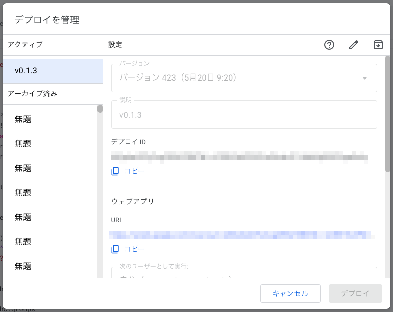
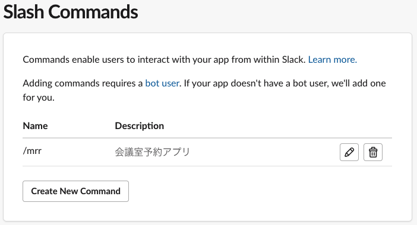
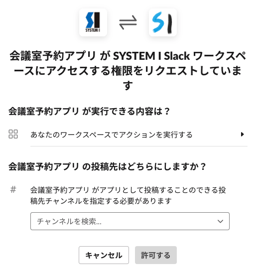

# 会議室予約

このアプリは Slack と Google カレンダーを連動させて、Slack のスラッシュコマンドからでも Google カレンダーからでも会議室を予約・確認する機能を提供する。

## デプロイ方法

`clasp` コマンドで GAS にコードを反映する。

```shell-session
$ npm ci
...
$ npx clasp login
...
$ npx clasp push
...
$ npx clasp open
...
$
```

ブラウザで GAS のプロジェクトが開くので、新しいデプロイを行う。デプロイ時には、以下のように必ずタグ名を付与する。また、古いデプロイはアーカイブする。これはアクティブなデプロイが一定数以上になると、新規のデプロイを行っても自動的にアーカイブ済みで作成されてしまうため。下図のようにアクティブがひとつだけになる状態をキープするのが望ましい。



デプロイ後、URL が割り当てられるため、そのアドレスを Slack の Slash コマンドに適用する。下図は Slack アプリのスラッシュコマンドの一覧で、編集ボタンから設定する。



適用後、ワークスペースの任意のチャンネルにアプリをインストールする。インストール先のチャンネルはしっかり確認する。


